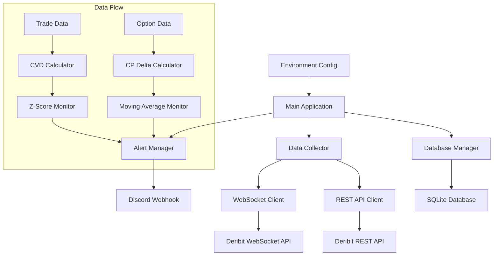

# Design Document

## Overview

暗号通貨データ収集・アラートシステムは、Node.js/TypeScriptベースのアプリケーションとして設計されます。Deribit Public APIからのリアルタイムデータ収集、SQLiteでのデータ永続化、Discord Webhookによるアラート通知の3つの主要機能を提供します。

システムは以下の設計原則に従います：
- 単一責任の原則に基づくモジュール設計
- 障害に対する耐性（自動再接続、リトライ機能）
- 設定の外部化（環境変数による管理）
- 拡張性を考慮したデータモデル

## Architecture



### アーキテクチャの主要コンポーネント：

1. **Data Collector**: Deribit APIからのデータ収集を担当
2. **Alert Manager**: アラート条件の監視と通知送信を担当
3. **Database Manager**: SQLiteデータベースへの読み書きを担当
4. **Environment Config**: 環境変数の管理を担当

## Components and Interfaces

### 1. Data Collector Module

```typescript
interface IDataCollector {
  startTradeDataCollection(): Promise<void>;
  startOptionDataCollection(): Promise<void>;
  stopCollection(): Promise<void>;
}

interface TradeData {
  symbol: string;
  timestamp: number;
  price: number;
  amount: number;
  direction: 'buy' | 'sell';
  tradeId: string;
}

interface OptionData {
  symbol: string;
  timestamp: number;
  underlyingPrice: number;
  markPrice: number;
  impliedVolatility: number;
  delta: number;
  gamma: number;
  theta: number;
  vega: number;
  rho: number;
}
```

### 2. Alert Manager Module

```typescript
interface IAlertManager {
  checkCPDelta25Alert(optionData: OptionData[]): Promise<void>;
  checkCVDAlert(tradeData: TradeData[]): Promise<void>;
  sendDiscordAlert(message: AlertMessage): Promise<void>;
}

interface AlertMessage {
  type: 'CP_DELTA_25' | 'CVD_ZSCORE';
  timestamp: number;
  value: number;
  threshold: number;
  message: string;
}
```

### 3. Database Manager Module

```typescript
interface IDatabaseManager {
  saveTradeData(data: TradeData[]): Promise<void>;
  saveOptionData(data: OptionData[]): Promise<void>;
  getTradeDataLast24Hours(): Promise<TradeData[]>;
  getLatestOptionData(): Promise<OptionData[]>;
  initializeDatabase(): Promise<void>;
}
```

### 4. Configuration Module

```typescript
interface AppConfig {
  discordWebhookUrl: string;
  databasePath: string;
  deribitApiUrl: string;
  optionDataInterval: number;
  cvdZScoreThreshold: number;
}
```

## Data Models

### SQLite Database Schema

```sql
-- 約定データテーブル
CREATE TABLE trade_data (
    id INTEGER PRIMARY KEY AUTOINCREMENT,
    symbol TEXT NOT NULL,
    timestamp INTEGER NOT NULL,
    price REAL NOT NULL,
    amount REAL NOT NULL,
    direction TEXT NOT NULL,
    trade_id TEXT UNIQUE NOT NULL,
    created_at DATETIME DEFAULT CURRENT_TIMESTAMP
);

-- オプションデータテーブル
CREATE TABLE option_data (
    id INTEGER PRIMARY KEY AUTOINCREMENT,
    symbol TEXT NOT NULL,
    timestamp INTEGER NOT NULL,
    underlying_price REAL NOT NULL,
    mark_price REAL NOT NULL,
    implied_volatility REAL NOT NULL,
    delta REAL NOT NULL,
    gamma REAL NOT NULL,
    theta REAL NOT NULL,
    vega REAL NOT NULL,
    rho REAL NOT NULL,
    created_at DATETIME DEFAULT CURRENT_TIMESTAMP
);

-- CVDデータテーブル（計算結果の保存）
CREATE TABLE cvd_data (
    id INTEGER PRIMARY KEY AUTOINCREMENT,
    timestamp INTEGER NOT NULL,
    cvd_value REAL NOT NULL,
    z_score REAL NOT NULL,
    created_at DATETIME DEFAULT CURRENT_TIMESTAMP
);

-- アラート履歴テーブル
CREATE TABLE alert_history (
    id INTEGER PRIMARY KEY AUTOINCREMENT,
    alert_type TEXT NOT NULL,
    timestamp INTEGER NOT NULL,
    value REAL NOT NULL,
    threshold REAL NOT NULL,
    message TEXT NOT NULL,
    created_at DATETIME DEFAULT CURRENT_TIMESTAMP
);

-- インデックス
CREATE INDEX idx_trade_data_timestamp ON trade_data(timestamp);
CREATE INDEX idx_trade_data_symbol ON trade_data(symbol);
CREATE INDEX idx_option_data_timestamp ON option_data(timestamp);
CREATE INDEX idx_option_data_symbol ON option_data(symbol);
CREATE INDEX idx_cvd_data_timestamp ON cvd_data(timestamp);
```

## Error Handling

### 1. API接続エラー
- WebSocket接続失敗時の自動再接続（指数バックオフ）
- REST API呼び出し失敗時のリトライ機能（最大3回）
- レート制限対応（適切な待機時間の実装）

### 2. データベースエラー
- SQLite接続エラー時の再試行
- データ整合性エラーの検出と処理
- ディスク容量不足の検出

### 3. アラート送信エラー
- Discord Webhook送信失敗時のリトライ
- 重複アラート防止機能
- アラート送信履歴の記録

### 4. 設定エラー
- 必須環境変数の検証
- 不正な設定値の検出とデフォルト値の適用

## Testing Strategy

### 1. Unit Tests
- 各モジュールの個別機能テスト
- データ変換ロジックのテスト
- 計算アルゴリズム（CVD、Z-score、移動平均）のテスト

### 2. Integration Tests
- Deribit API接続テスト（モック使用）
- SQLiteデータベース操作テスト
- Discord Webhook送信テスト（モック使用）

### 3. End-to-End Tests
- 全体的なデータフローのテスト
- アラート機能の統合テスト
- 障害回復機能のテスト

### 4. Performance Tests
- 大量データ処理のパフォーマンステスト
- メモリ使用量の監視
- 長時間稼働時の安定性テスト

## Security Considerations

### 1. 環境変数管理
- Discord Webhook URLの安全な管理
- .envファイルの.gitignore登録
- 本番環境での環境変数の適切な設定

### 2. データ保護
- SQLiteデータベースファイルのアクセス権限設定
- 機密データの暗号化（必要に応じて）

### 3. API使用
- Deribit Public APIの利用規約遵守
- レート制限の適切な管理
- API キーが不要なPublic APIのみ使用

## Deployment and Operations

### 1. 環境要件
- Node.js 18以上
- SQLite3
- 十分なディスク容量（~/Volume/buffalohd）

### 2. 設定ファイル
```env
DISCORD_WEBHOOK_URL=https://discord.com/api/webhooks/1351401127882522676/cX7rnG1K2F5ImzgOpRntiYspJIsOTVe793LQs3wn2QTNj5Zztriok7hD9jdTqZOT71yT
DATABASE_PATH=~/Volume/buffalohd/crypto_data.db
DERIBIT_API_URL=wss://www.deribit.com/ws/api/v2
OPTION_DATA_INTERVAL=3600000
CVD_ZSCORE_THRESHOLD=2.0
```

### 3. 監視とログ
- アプリケーションログの出力
- エラー発生時の詳細ログ
- パフォーマンスメトリクスの記録